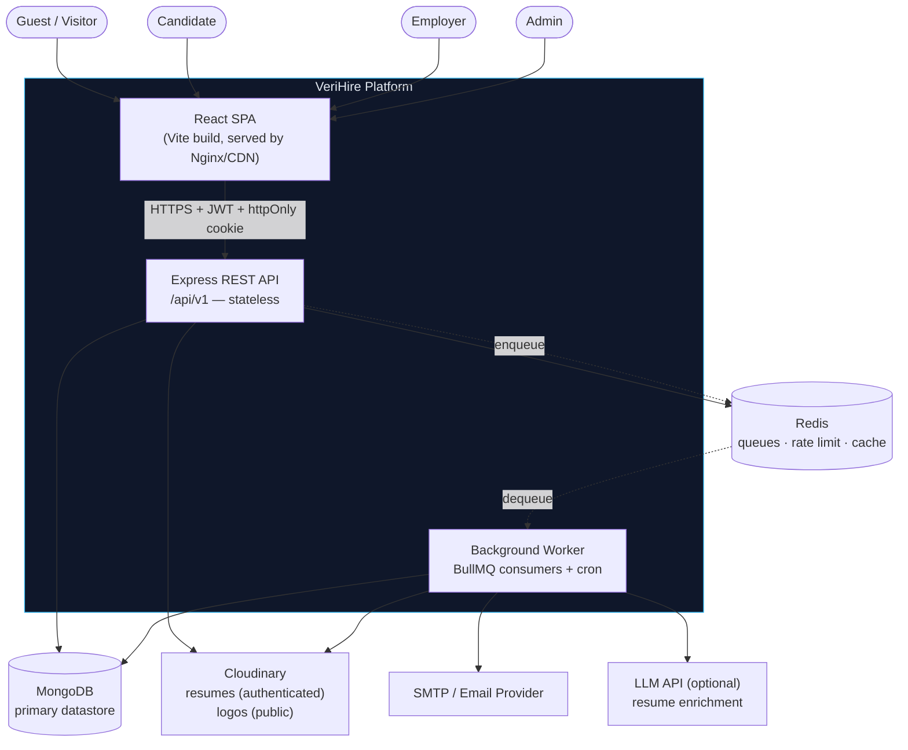
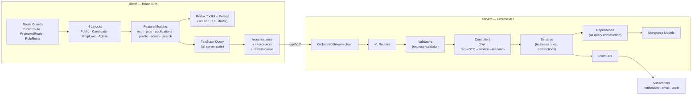
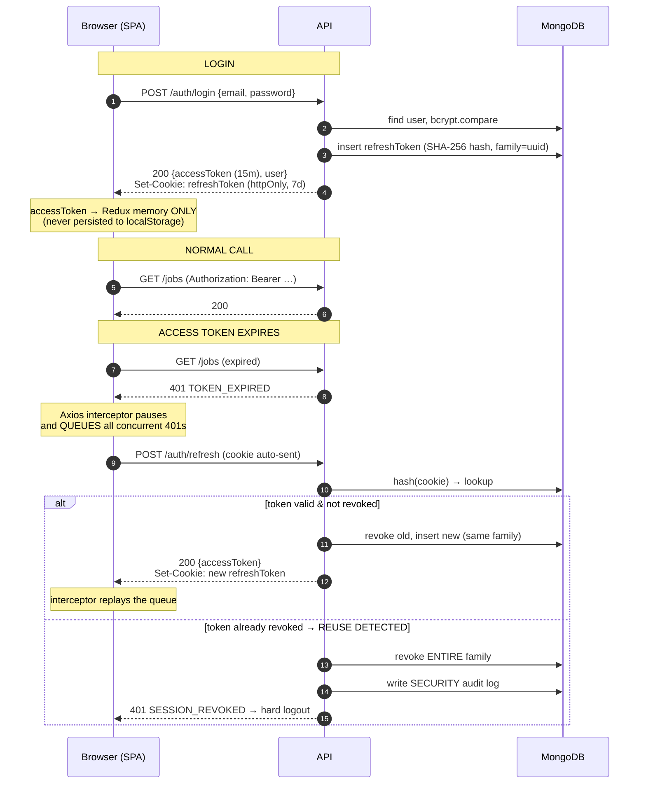
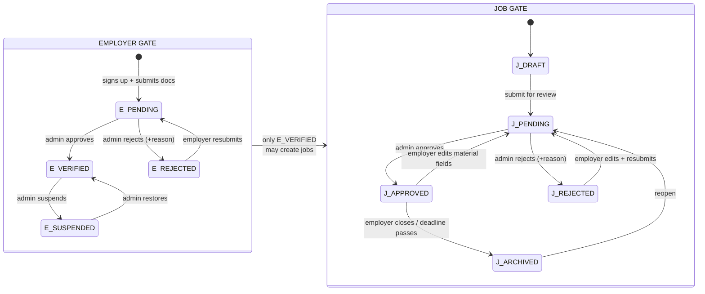
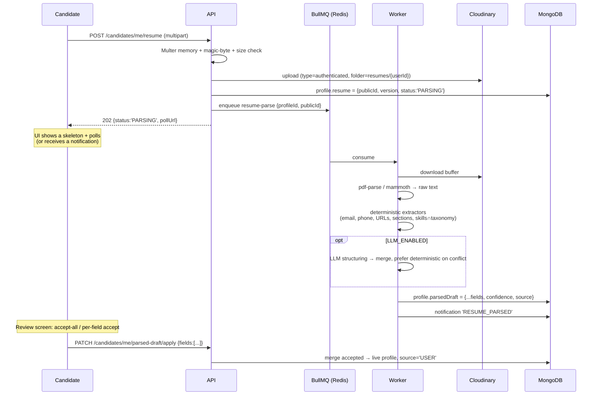
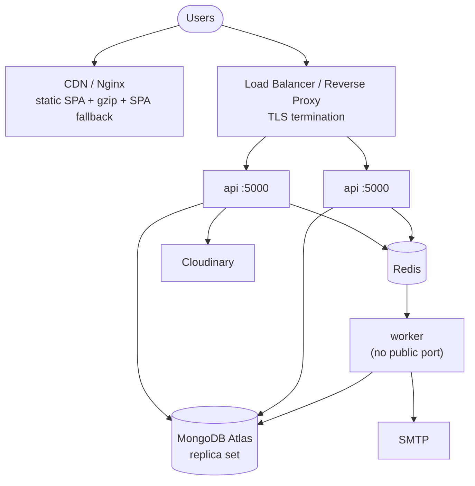

# 01 — System Architecture

---

## 1. Context Diagram (C4 — Level 1)



**Key property:** the API process is **stateless**. Sessions live in MongoDB (hashed refresh
tokens), rate-limit counters in Redis, files in Cloudinary. Any API container can serve any
request, so scaling is `docker compose up --scale api=N` behind a load balancer.

---

## 2. Container Diagram (C4 — Level 2)



---

## 3. Request Lifecycle (the middleware chain, in order)

```
   ┌─ INBOUND ────────────────────────────────────────────────────────────┐
   │                                                                      │
 1 │ helmet()                       → security headers, CSP, HSTS         │
 2 │ cors({ origin: whitelist, credentials: true })                       │
 3 │ compression()                                                        │
 4 │ express.json({ limit:'10kb' }) → body-size DoS guard                 │
 5 │ cookieParser(COOKIE_SECRET)                                          │
 6 │ mongoSanitize()                → strips $ and . from keys            │
 7 │ xss-clean / sanitize-html      → strips script payloads              │
 8 │ hpp()                          → HTTP parameter pollution guard      │
 9 │ requestId()                    → uuid → req.id, echoed as X-Req-Id   │
10 │ morgan(':id :method :url…')    → piped into Winston                  │
11 │ globalRateLimiter              → Redis store, per-IP                 │
   │                                                                      │
   │        ── PER-ROUTE ──                                               │
12 │   routeRateLimiter             → tighter on /auth/*                  │
13 │   authenticate                 → verifies access JWT → req.user      │
14 │   requireVerifiedEmail         → where applicable                    │
15 │   authorize(ROLES.EMPLOYER)    → RBAC                                │
16 │   requireVerifiedEmployer      → THE USP GATE (job-write routes)     │
17 │   upload.single('resume')      → Multer memory + MIME/magic check    │
18 │   validate([...rules])         → express-validator → 422 on fail     │
19 │   asyncHandler(controller)     → promise rejection → next(err)       │
   │                                                                      │
   └─ OUTBOUND ───────────────────────────────────────────────────────────┘
20 │ ApiResponse.success(res, …)    → uniform envelope
21 │ notFoundHandler                → 404 for unmatched routes
22 │ globalErrorHandler             → ApiError → envelope; leaks nothing in prod
```

Every numbered step is a real file in `server/src/middlewares/`. See
[08-BACKEND-ARCHITECTURE.md](08-BACKEND-ARCHITECTURE.md).

---

## 4. Authentication & Token Flow



**Refresh-queue detail (frontend):** a single in-flight refresh promise is shared by all pending
requests. Without this, 6 parallel 401s trigger 6 rotations and the reuse-detector logs the user
out — a classic and very confusing production bug. Implemented in
`client/src/api/axiosClient.js`.

---

## 5. The USP Flow — Two-Gate Verification



**Two enforcement points, deliberately redundant (defence in depth):**

1. **Write-side** — `requireVerifiedEmployer` middleware rejects `POST/PUT /jobs` with `403
   EMPLOYER_NOT_VERIFIED` unless the company is `VERIFIED` and `ACTIVE`.
2. **Read-side** — `buildPublicJobFilter()` re-checks employer verification on every public read
   via a `$lookup`-free denormalised flag (`job.isPubliclyVisible`, maintained by the service
   layer + a nightly reconciliation cron).

> **Why redundant?** If an admin suspends a verified employer, that employer's already-approved
> jobs must vanish from public search *immediately*. Write-side checks can't do that
> retroactively. The read-side filter can. Suspension therefore triggers a bulk
> `jobs.updateMany({employer}, {isPubliclyVisible:false})` **and** the filter double-checks.

---

## 6. Resume Parsing Pipeline (ADR-006)



**Merge rule (non-negotiable):** applying a draft **never** overwrites a field whose current
`source === 'USER'` unless that exact field is explicitly listed in the accept payload. Re-parsing
a new resume version regenerates `parsedDraft` and touches nothing live.

---

## 7. Deployment Topology



### docker-compose services

| Service | Image / build | Ports | Notes |
|---|---|---|---|
| `client` | multi-stage: node build → nginx:alpine | 80 | SPA fallback `try_files … /index.html` |
| `api` | node:20-alpine, non-root user | 5000 | healthcheck `GET /api/v1/health` |
| `worker` | same image, `CMD ["node","src/worker.js"]` | — | scales independently |
| `mongo` | mongo:7 | 27017 | named volume, dev only (Atlas in prod) |
| `redis` | redis:7-alpine | 6379 | AOF persistence |
| `mongo-express` | dev profile only | 8081 | `--profile dev` |

Images are multi-stage and run as a non-root `node` user; `.dockerignore` excludes
`node_modules`, `.env*`, `logs/`, `uploads/`.

---

## 8. Environment Configuration

All env vars are validated **at boot** by `server/src/config/env.js` (express-validator-style
schema). **The process refuses to start if a required var is missing or malformed** — no more
"undefined JWT secret" reaching production.

| Var | Required | Example / note |
|---|---|---|
| `NODE_ENV` | ✅ | `development` \| `production` \| `test` |
| `PORT` | | `5000` |
| `MONGO_URI` | ✅ | must start `mongodb` |
| `JWT_ACCESS_SECRET` | ✅ | ≥ 32 chars, enforced |
| `JWT_ACCESS_EXPIRY` | | `15m` |
| `JWT_REFRESH_SECRET` | ✅ | ≥ 32 chars, **must differ** from access secret |
| `JWT_REFRESH_EXPIRY` | | `7d` |
| `COOKIE_SECRET` | ✅ | |
| `CLIENT_URL` | ✅ | CORS whitelist + email deep links |
| `CLOUDINARY_CLOUD_NAME` / `_API_KEY` / `_API_SECRET` | ✅ | |
| `SMTP_HOST` / `_PORT` / `_USER` / `_PASS` / `EMAIL_FROM` | ✅ | |
| `REDIS_URL` | ⚠️ | absent → in-process queue + memory rate-limit (dev only, warns loudly) |
| `LLM_PROVIDER` / `LLM_API_KEY` | ❌ | absent → deterministic parser only |
| `ADMIN_SEED_EMAIL` / `_PASSWORD` | ✅ (first run) | consumed by `npm run seed:admin` |
| `BCRYPT_ROUNDS` | | `12` |
| `RATE_LIMIT_WINDOW_MS` / `_MAX` | | `900000` / `100` |

`.env.example` ships with every key documented and **no real values**. `.env` is gitignored.

---

## 9. Cross-Cutting Concerns

| Concern | Mechanism | Location |
|---|---|---|
| Logging | Winston (JSON in prod, pretty in dev) + Morgan stream, daily rotate, `requestId` on every line | `config/logger.js` |
| Error handling | `ApiError` hierarchy → single `globalErrorHandler` | `errors/`, `middlewares/error.middleware.js` |
| Response shape | `ApiResponse.success/paginated` wrapper | `utils/apiResponse.js` |
| Async errors | `asyncHandler` wrapper on every controller | `utils/asyncHandler.js` |
| Transactions | `withTransaction()` helper; used for apply-to-job, verification decisions | `database/transaction.js` |
| Caching | Redis `cache-aside` on public job list + company directory, 60 s TTL, invalidated on approve/archive | `services/cache.service.js` |
| Cron | `node-cron` in worker: expire deadlines, purge tokens, reconcile visibility flags, digest emails | `cron/` |
| Health | `/api/v1/health` (liveness) + `/health/ready` (Mongo + Redis ping) | `routes/health.routes.js` |
| Graceful shutdown | SIGTERM → stop accepting → drain in-flight → close Mongo/Redis → exit | `server.js` |
