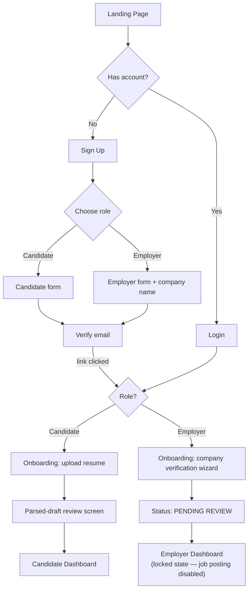
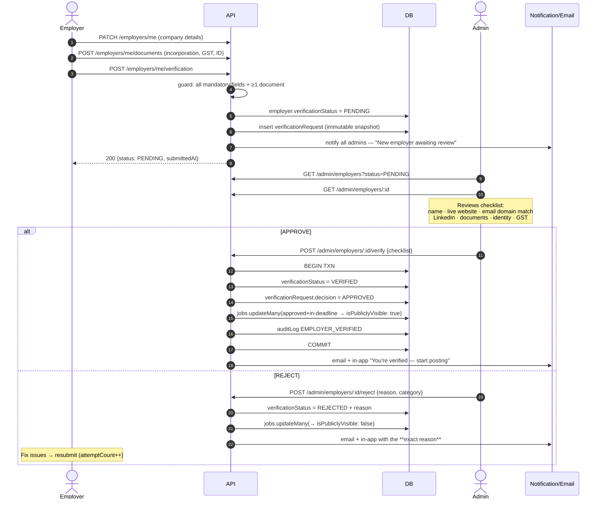
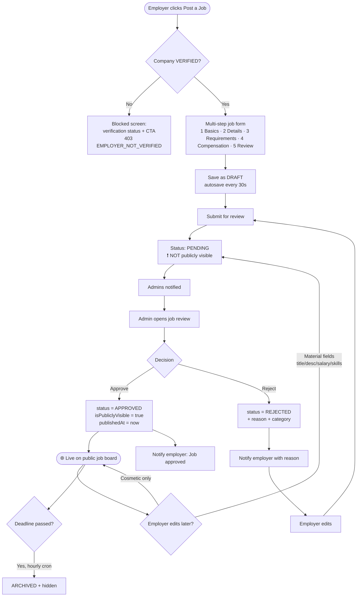
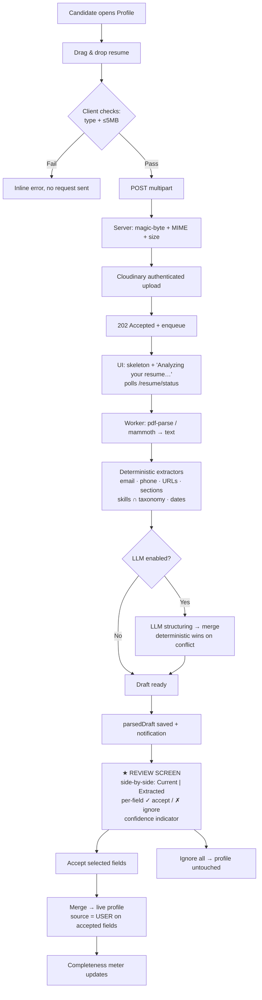
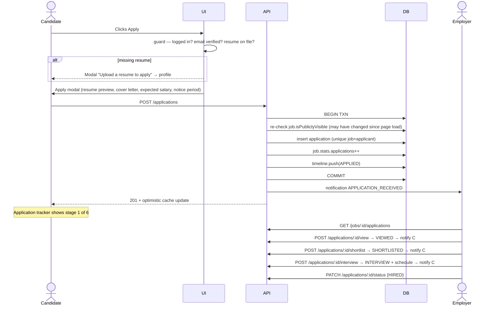
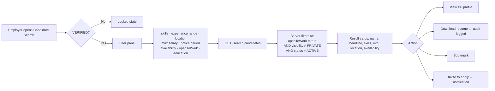
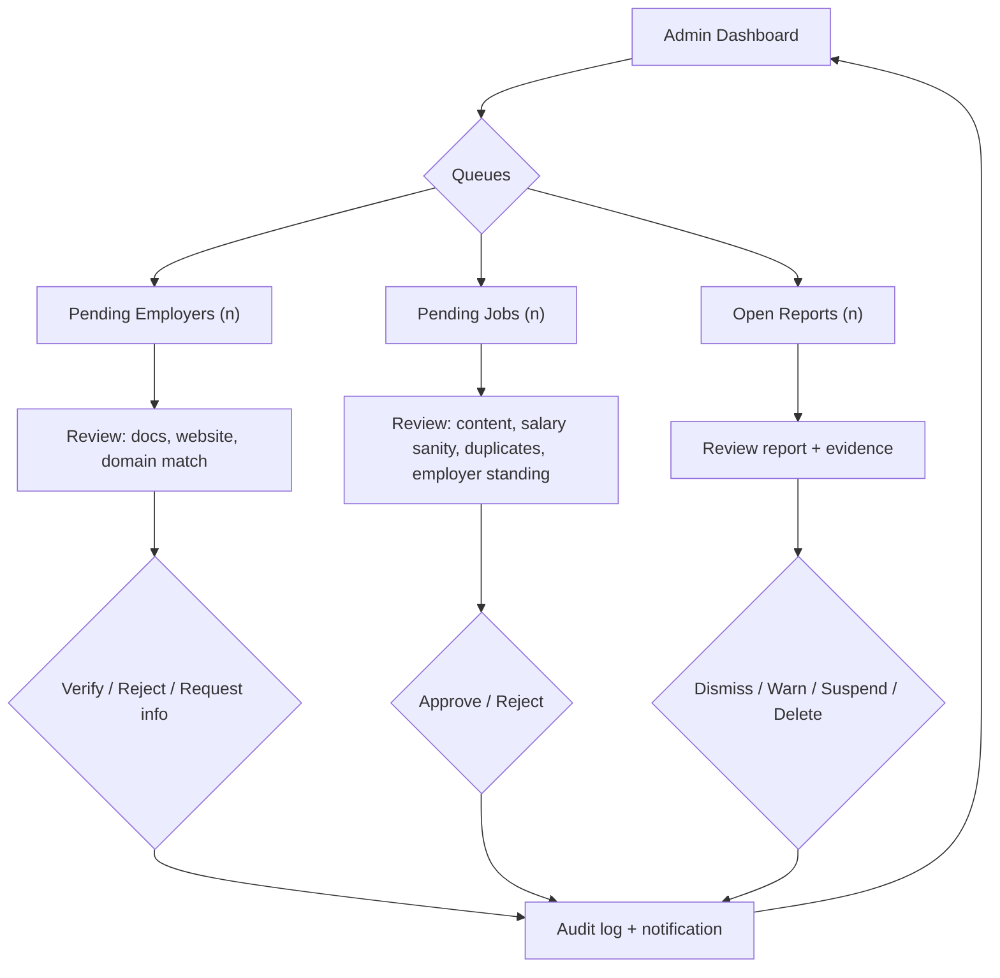
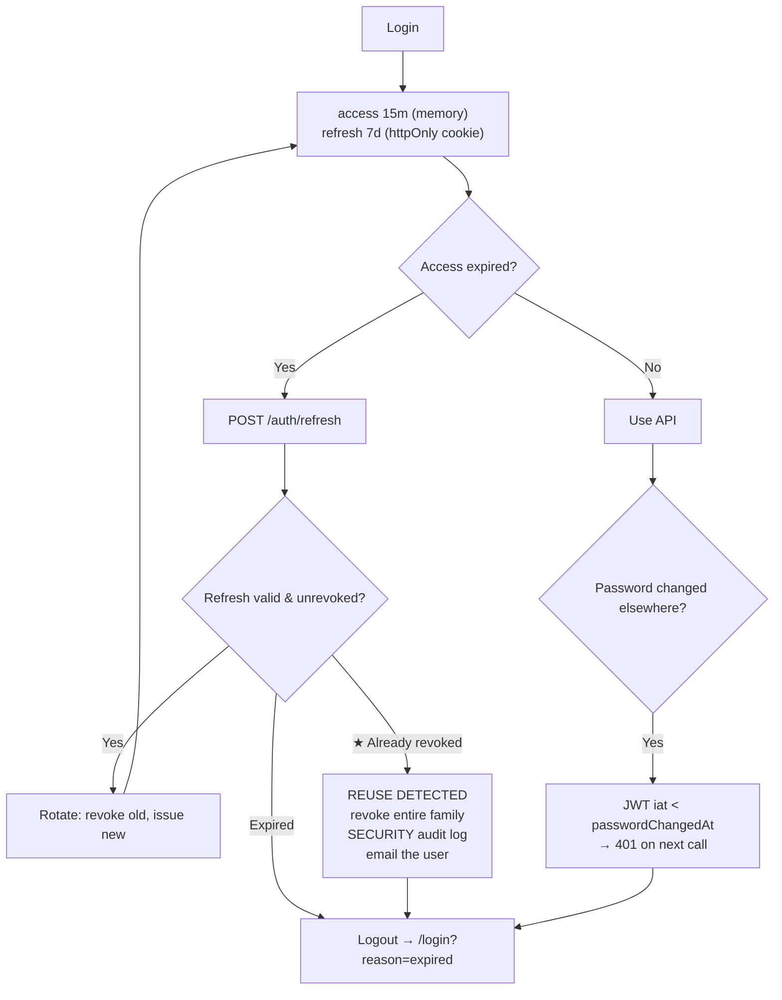

# 05 — User Flows

---

## 1. Role Selection & Onboarding



**Design decision:** an employer lands on a **functional but locked** dashboard, not an error
page. It shows the verification checklist, what's missing, expected review time, and a preview of
what unlocks. Blocking users with a bare 403 is the fastest way to lose them.

---

## 2. ★ Employer Verification (Gate 1)



---

## 3. ★ Job Posting & Approval (Gate 2)



> **The material-vs-cosmetic edit rule matters.** Without it, a fraudster gets one clean job
> approved and then rewrites it into a scam. The list of material fields is explicit in
> `job.service.js#MATERIAL_FIELDS` and any change to it re-enters the queue.

---

## 4. Candidate Resume Upload → Profile Autofill



**The rule the brief demands:** *"Never force AI extracted values."* Nothing from the parser ever
reaches the live profile without an explicit click. Fields the candidate has already edited by
hand are shown as "you've customised this" and are **not** pre-checked for overwrite.

---

## 5. Candidate Applies to a Job



### Application timeline as the candidate sees it
```
● Applied          31 Jul 2026, 10:04    You applied to this job
● Viewed           31 Jul 2026, 14:22    Employer viewed your application
● Shortlisted       1 Aug 2026, 09:10    You've been shortlisted 🎉
◉ Interview         3 Aug 2026, 11:00    Round 1 · Online · Join link
○ Offer                                  —
```

---

## 6. Employer Searches the Candidate Database



**Privacy rule:** email and phone are **masked** (`r•••@gmail.com`) until the candidate has
applied to one of that employer's jobs or has been shortlisted. Candidates control exposure with
the `openToWork` toggle and `profileVisibility` setting.

---

## 7. Admin Moderation Loop



Every decision writes `{actor, action, entityId, before, after, reason, ip, at}` to `auditLogs`.
The dashboard's "Recent Activity" feed is a projection of that collection — one source of truth,
no parallel bookkeeping.

---

## 8. Session Lifecycle (happy + attack paths)



---

## 9. Notification Triggers (17 events)

| Event | → Candidate | → Employer | → Admin |
|---|---|---|---|
| `EMPLOYER_SUBMITTED_VERIFICATION` | | ✔ ack | ✔ new in queue |
| `EMPLOYER_VERIFIED` | | ✔ 🎉 | |
| `EMPLOYER_REJECTED` | | ✔ + reason | |
| `EMPLOYER_SUSPENDED` | | ✔ + reason | |
| `JOB_SUBMITTED` | | ✔ ack | ✔ new in queue |
| `JOB_APPROVED` | | ✔ + live link | |
| `JOB_REJECTED` | | ✔ + reason | |
| `JOB_EXPIRING_SOON` (3 days) | | ✔ | |
| `JOB_EXPIRED` | | ✔ | |
| `APPLICATION_RECEIVED` | | ✔ | |
| `APPLICATION_VIEWED` | ✔ | | |
| `APPLICATION_SHORTLISTED` | ✔ 🎉 | | |
| `INTERVIEW_SCHEDULED` | ✔ + details | | |
| `APPLICATION_REJECTED` | ✔ (kind copy) | | |
| `APPLICATION_HIRED` | ✔ 🎉 | | |
| `PASSWORD_CHANGED` | ✔ | ✔ | ✔ |
| `NEW_MATCHING_JOB` (digest) | ✔ | | |

Channels per event are configured in one table (`notificationConfig.js`) — `{inApp, email}` —
so muting email for a type is a data change, not a code change.
